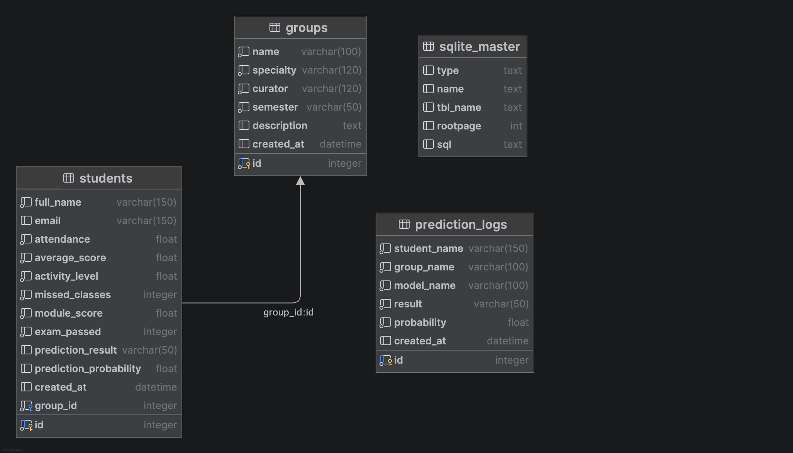

# Student Success Prediction System

У цьому проєкті я реалізував вебзастосунок для прогнозування успішності студентів на основі їхніх навчальних показників.  
Основна ідея системи полягає в тому, щоб використати дані про студента (відвідуваність, середній бал, активність, кількість пропусків тощо) і за допомогою алгоритму машинного навчання спрогнозувати результат складання іспиту.

Застосунок розроблений як вебсистема на Python з використанням FastAPI.  
У системі можна створювати групи, додавати студентів, редагувати їхні дані та запускати прогнозування результатів навчання.

---
# Функціонал системи

У додатку реалізовано наступні можливості.

### Робота з групами
Система дозволяє створювати академічні групи, змінювати їхні дані та переглядати список усіх груп.  
Для кожної групи можна зберігати інформацію про спеціальність, куратора, семестр та опис.

### Робота зі студентами
Для кожної групи можна додавати студентів.  
Також доступні:
- редагування даних студента
- видалення студента
- перегляд списку студентів у групі

Зберігаються основні показники навчання:
- відвідуваність
- середній бал
- активність
- кількість пропущених занять
- бали за модулі

### Прогнозування результату
У системі реалізована модель машинного навчання (Logistic Regression), яка навчається на наявних даних студентів.

Після навчання модель може:
- прогнозувати результат складання іспиту
- визначати ймовірність успішного складання

### Логи прогнозів
Кожен прогноз записується в окрему таблицю, що дозволяє зберігати історію прогнозів.

---

# Технології

Для реалізації проєкту я використав:

- **Python**
- **FastAPI**
- **SQLite**
- **SQLAlchemy**
- **scikit-learn**
- **Jinja2**
- **HTML / CSS**

---

# Структура проєкту

```bash
module_1
│
├── app
│   ├── main.py
│   ├── models.py
│   ├── database.py
│   └── services.py
│
├── templates
├── static
│
├── run.py
├── config.json
└── requirements.txt
```

---
# Схема бази даних

Нижче показана структура бази даних, яка використовується в системі.



У базі даних використовується кілька основних таблиць.

### groups
Таблиця для збереження інформації про академічні групи.

Основні поля:
- name — назва групи  
- specialty — спеціальність  
- curator — куратор групи  
- semester — семестр  
- description — опис групи  
- created_at — дата створення  

---

### students
Таблиця для збереження інформації про студентів.

Основні поля:
- full_name — ім’я студента  
- email — email  
- attendance — відвідуваність  
- average_score — середній бал  
- activity_level — активність  
- missed_classes — кількість пропусків  
- module_score — бали за модулі  
- exam_passed — фактичний результат іспиту  

Також у таблиці зберігається:
- prediction_result — результат прогнозу  
- prediction_probability — ймовірність складання іспиту  

Студент прив’язаний до групи через поле **group_id**.

---

### prediction_logs
Таблиця для збереження історії прогнозів.

Основні поля:
- student_name  
- group_name  
- model_name  
- result  
- probability  
- created_at  

Це дозволяє зберігати всі результати прогнозування.

---

# Як запустити проєкт

### 1. Клонувати репозиторій

git clone https://github.com/b-serhii/technical-support-pj.git
---

### 2. Перейти у папку module_1
cd module_1
---
### 3. Створити віртуальне середовище
python -m venv .venv


---
### 4. Активувати середовище
Mac / Linux
source .venv/bin/activate
Windows
.venv\Scripts\activate
---

### 5. Встановити залежності
pip install -r requirements.txt
---

### 6. Запустити застосунок
python run.py
---

### 7. Відкрити у браузері
http://127.0.0.1:8000
---